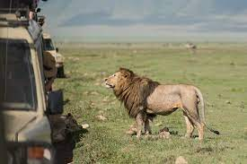

"# zoo_html" 
# Animal Sanctuary Project

Welcome to the Animal Sanctuary Project! This project is a fictional website for an Animal Sanctuary, showcasing information about three magnificent animals: pandas, elephants, and zebras. The website aims to raise awareness about these animals, their habitats, and the importance of conservation efforts.

## Project Overview

The Animal Sanctuary Project is built using HTML, CSS, and Bootstrap to create a responsive and visually appealing website. It comprises three main pages, each dedicated to a specific animal:

1. **Pandas Page**: Discover the Magic of Giant Pandas! Learn about the unique characteristics of pandas, their endangered status, and the conservation efforts in place to protect them.

2. **Elephants Page**: Explore the Majesty of Elephants! Witness the intelligence and beauty of elephants, their close family bonds, and the significance of preserving their natural habitats.

3. **Zebras Page**: Journey with Zebras! Understand the striking features of zebras, their social behavior, and the challenges they face in the wild.

## Screenshots

### Pandas Page

### Elephants Page

### Zebras Page

## How to Run the Project

To view the Animal Sanctuary website locally, follow these steps:

1. Clone this GitHub repository to your local machine using `git clone`.

2. Open the `index.html` file in your web browser to access the home page.

3. Navigate to the "Pandas," "Elephants," or "Zebras" pages using the navigation bar.

## Built With

- HTML
- CSS
- Bootstrap

## Credits

- Images: [Unsplash](https://unsplash.com)
- Bootstrap: [Bootstrap Documentation](https://getbootstrap.com/docs/5.3/getting-started/introduction/)

## Author

This project was created by Nadav Cohen. If you have any questions or feedback, feel free to reach out!

---

Thank you for exploring the Animal Sanctuary Project. We hope you enjoy learning about these fascinating creatures and the importance of conservation efforts to protect them!